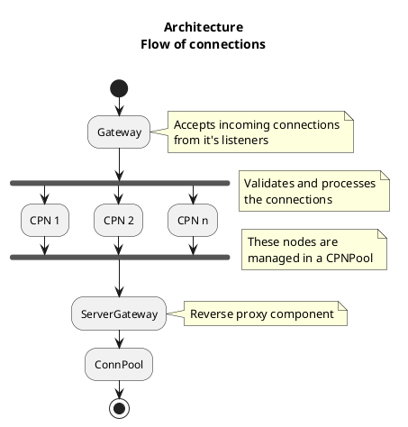
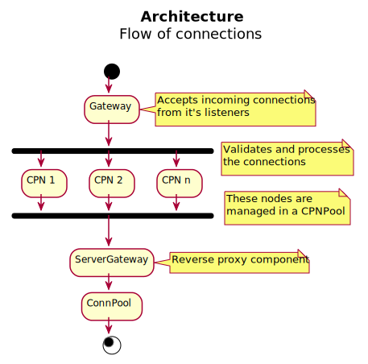

# Architecture

Infrared consists of a collection of proxies. Each proxy consists of four abstract components:
- A Gateway that manages a collection of network listeners (TCP and/or UDP)
- A Connection Processing Node Pool (CPNPool) that consists of a configurable amount of concurrent workers that process connections
- A Server Gateway that maps processed connections to the backend servers. This is the part of Infrared that handle the reverse proxy logic.
- A Connection Pool (ConnPool) that starts the proxy for all connections that could be mapped by the Server Gateway.

<!--

-->

  

