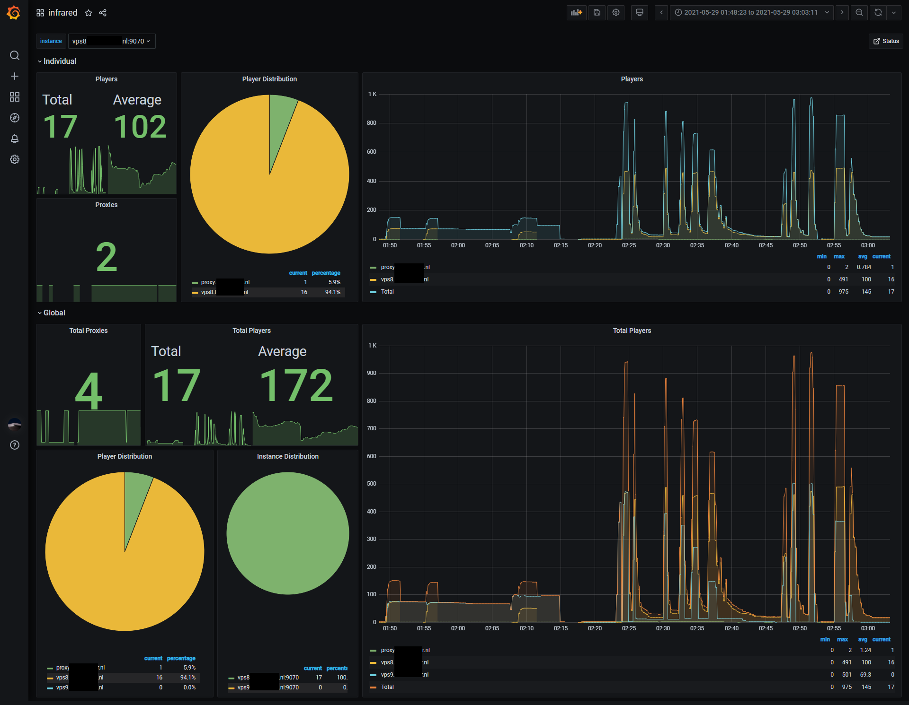

# Grafana Dashboard
We provide a Grafana dashboard that visualizes the infrared prometheus exporters metrics. You can see all values per instance or globally across all instances.

## Prerequisites

* Infrared >= 1.1.0 with `-enable-prometheus` active
* Grafana >= 7.0.0
* Prometheus >= 2.0.0
* [Pie Chart plugin](https://grafana.com/grafana/plugins/grafana-piechart-panel/)

A Prometheus data source needs to be [added](https://prometheus.io/docs/visualization/grafana/#using) before installing the dashboard.

## Installing the Dashboard

In the Grafana UI complete the following steps:

1. Use the *New Dashboard* button and click *Import*.
2. Upload `dashboard.json` or copy and paste the contents of the file in the textbox and click *Load*.
3. You can change the name and folder and click *Import*.
4. The dashboard will appear. Under *Dashboard settings*, *Variables* and *instance* you can choose your Data source and click 'Update' to refresh the list of instances.

## Graphs

The dashboard comes with 2 rows with the following graphs:

* Individual
  * Total and average player count per instance.
  * Amount of active proxies.
  * Player distribution pie chart ([Pie Chart plugin](https://grafana.com/grafana/plugins/grafana-piechart-panel/) required).
  * Player distribution graph.
* Global
  * Total and average player count for all instances.
  * Amount of active proxies on all instances.
  * Player distribution pie chart ([Pie Chart plugin](https://grafana.com/grafana/plugins/grafana-piechart-panel/) required).
  * Instance distribution pie chart ([Pie Chart plugin](https://grafana.com/grafana/plugins/grafana-piechart-panel/) required).
  * Player distribution graph.